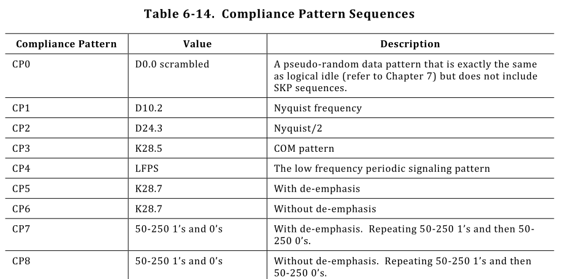
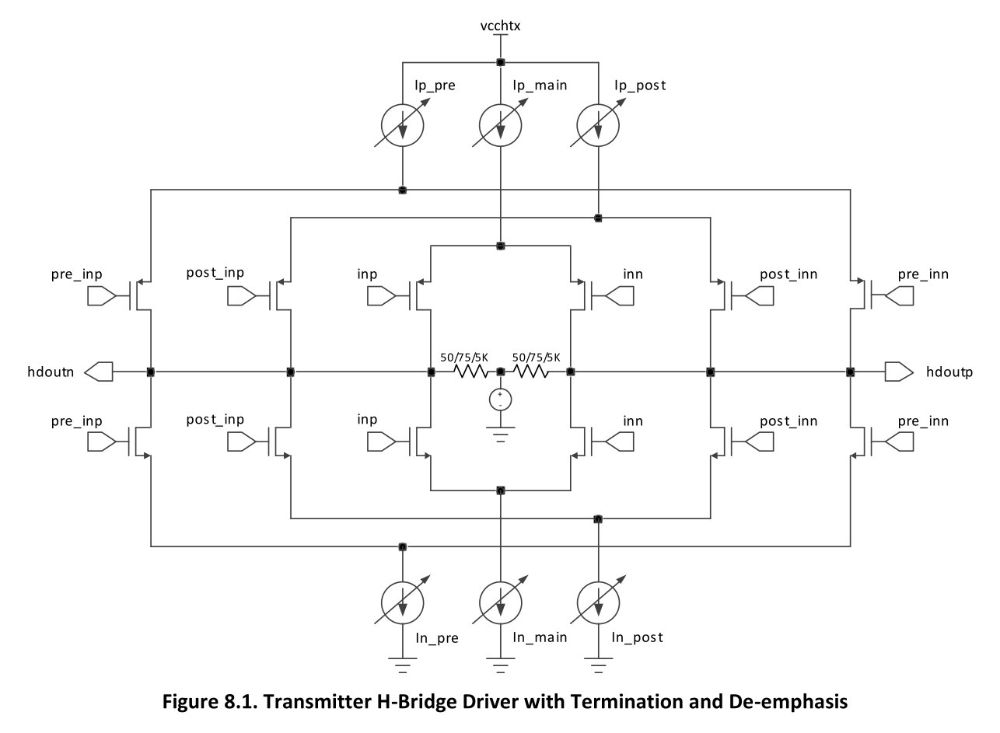
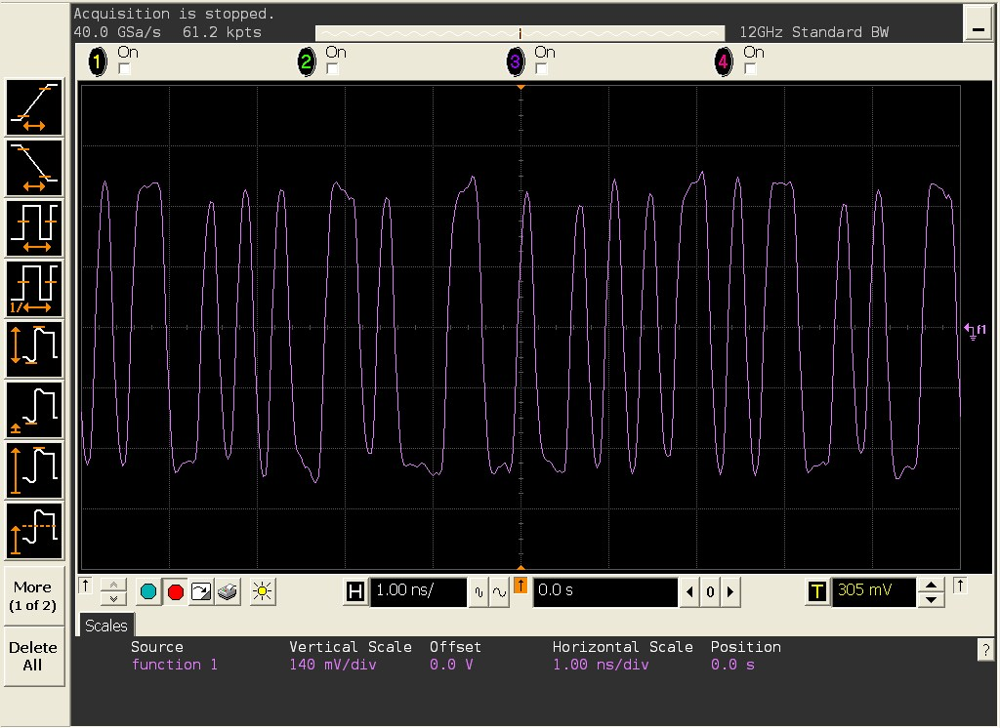
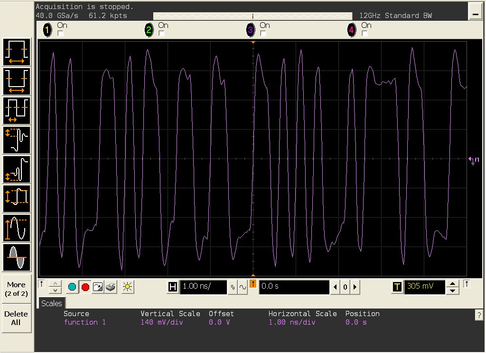
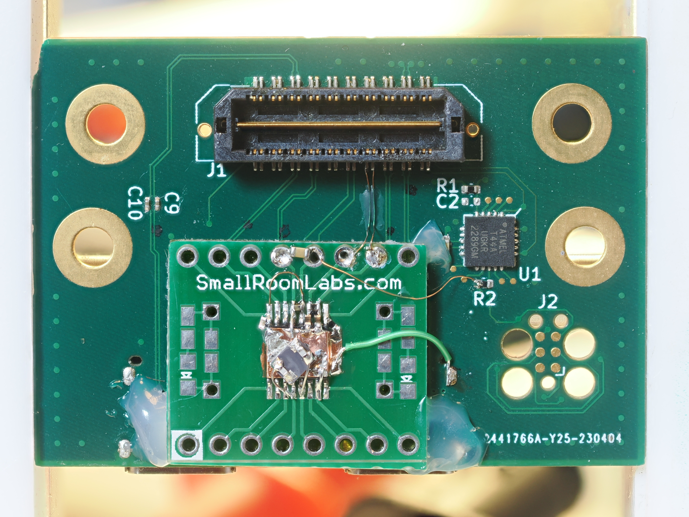
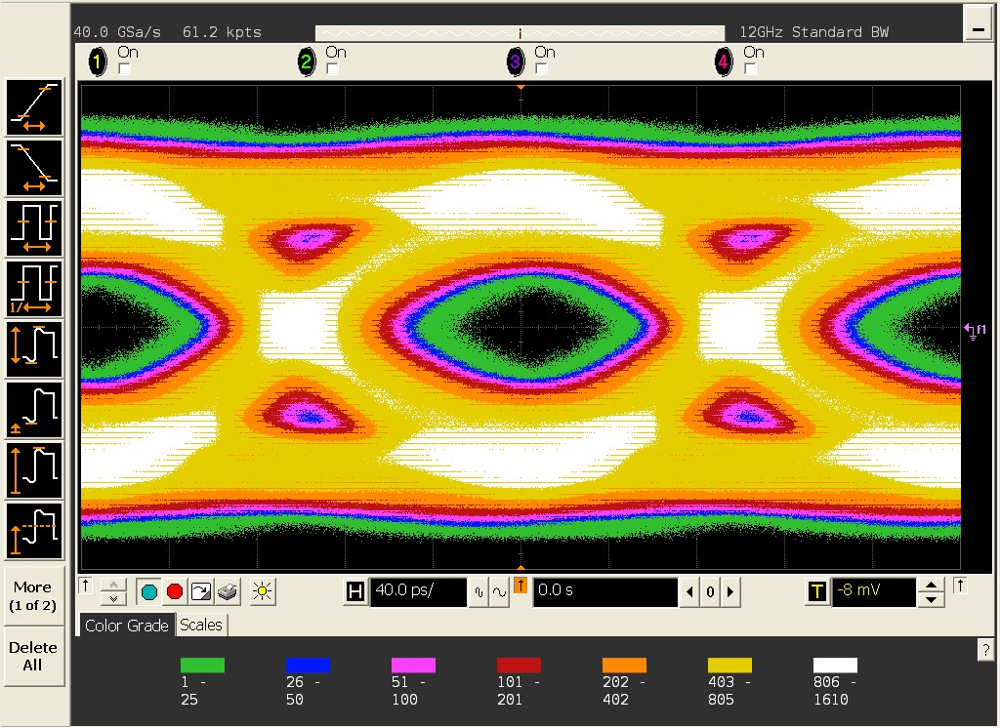
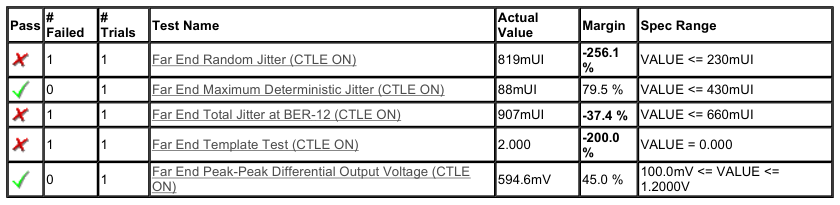
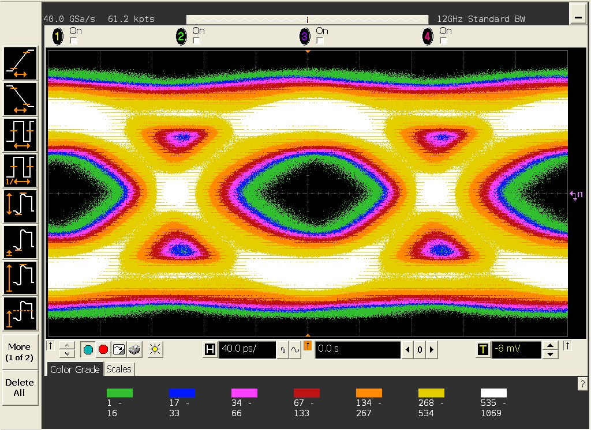
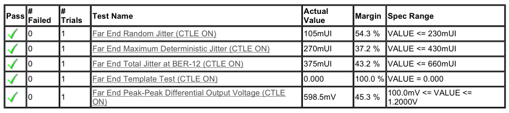
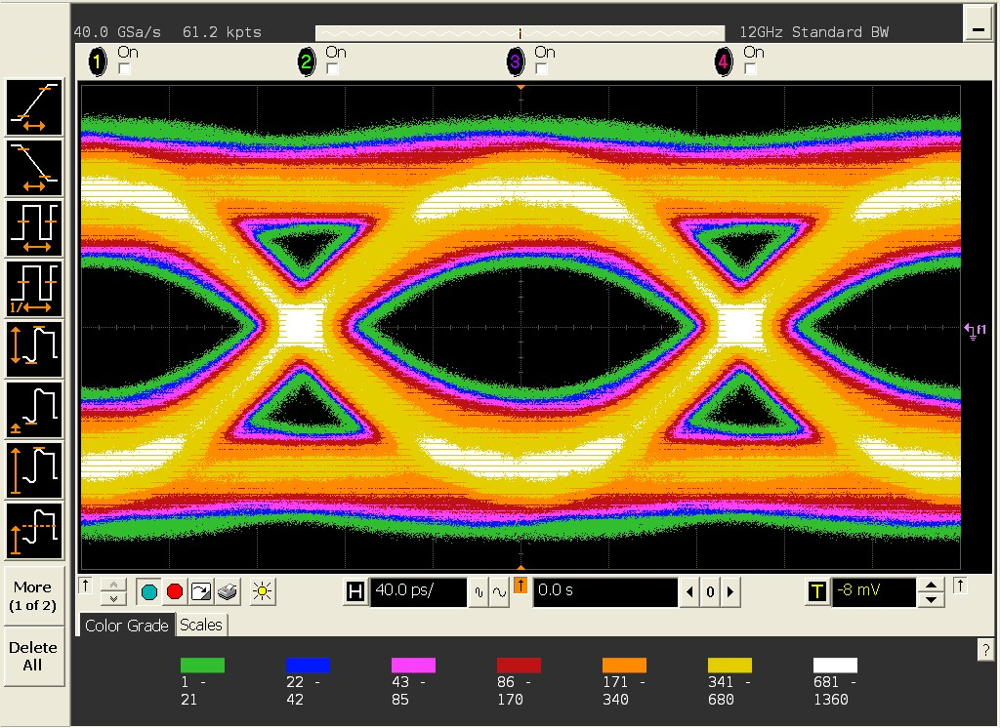

# 2026-05-09 LUNA SuperSpeed USB Improvements

This report describes progress so far on changes to the ECP5 SerDes SuperSpeed implementation, adding compliance mode with test pattern generation and improving overall signal integrity.

## Test patterns

The USB 3.x specifications require that devices support "compliance mode". In this mode, the device generates various test patterns for testing its physical layer electrical characteristics.

[This pull request](https://github.com/greatscottgadgets/luna/pull/303) implements entry into compliance mode and generation of most Gen1 patterns (CP4 still to be implemented).

The PR also implements runtime-switchable de-emphasis support required for several patterns and the PIPE interface `TxOnesZeroes` signal required for patterns CP7 & CP8.

## De-emphasis

For Gen1 SuperSpeed (5 GT/s) signals, the specification requires that 3.5 dB of de-emphasis be applied to the TX channel. This means that the initial symbol after a transition should be at full amplitude, then any subsequent symbols are reduced in amplitude by 3.5 dB. This has the effect of increasing the relative amplitude of higher frequency content to counteract losses in cables, connectors, and PCB traces.

The ECP5 SerDes transmitter has several H-bridge drivers in parallel (called slices) that can be driven with either the main data, pre data (ahead by one symbol & inverted), or post data (behind by one symbol & inverted). By driving some slices with main data and some with post data and adjusting their relative drive currents, the specified level of de-emphasis can be achieved.

Unfortunately the documentation on how to configure this is quite limited and sometimes misleading. The expectation is to use the proprietary configuration wizard provided by the manufacturer. So it took some trial and error to set up correctly using the open-source toolchain.

One important note is that there are various parameters which only affect the configuration wizard and have no effect on the hardware itself. `CHx_TXAMPLITUDE`, `CHx_TXDEPRE`, and `CHx_TXDEPOST` are some relevant examples of this.

Instead, we configure each slice's drive current and data source by using the `CHx_TDRV_SLICEy_CUR` and `CHx_TDRV_SLICEy_SEL` parameters. We then use the SerDes Client Interface (SCI) to switch one slice between post data/main data as required to enable/disable de-emphasis at run-time.

Below shows the difference in the waveform, measured at the near end (close to the SerDes TX pins). Higher amplitude peaks can be seen after each transition in the data:

### CP0 waveform without de-emphasis

### CP0 waveform with de-emphasis

## jitter

SuperSpeed USB has quite strict requirements on jitter requiring a good quality reference clock. Existing development boards drive the SerDes reference clock using the FPGA's PLL. The SerDes user guide includes the following warning discouraging this:

> The FPGA PLL output jitter may not meet system specifications at higher data rates. The use of an FPGA PLL
is not recommended in jitter-sensitive applications.

It was found in testing that both an ECPIX-5 and ButterStick (with USB3 SYZYGY addon) in their current configuration would fail to meet specification on random jitter, leading to much poorer signal integrity.

To evaluate a fix for this, a USB3 SYZYGY adapter board was modified to add a PI6C557-03BLEX clock generator IC (usually used for PCIe). This generates a 200 MHz low-jitter clock that is then connected directly to the SerDes reference clock input.

This dramatically improved the jitter and eye-diagram quality as shown in the results below.

## Results

Below are some results of testing using a ButterStick FPGA development and a [custom SYZYGY to USB-C addon board](https://github.com/miek/test-pcbs/tree/main/syzygy-usb3). Each section includes a summary of results from U7243A compliance test software and an eye diagram plot of the `CP0` test pattern.

### Before any changes

### With de-emphasis added

### With de-emphasis and improved reference clock

